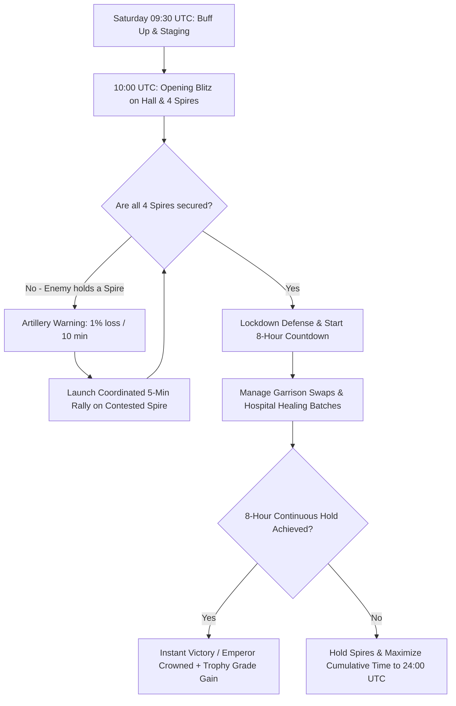

# ⚔️ Conquest of Lords: Strategic & Operational Playbook

> **Event Type:** Cross-Realm Warfare (State vs. State / SvS)  
> **Schedule:** Bi-weekly (Every 2 weeks) on **Saturday at 10:00 AM UTC**  
> **Duration:** 24 Hours (Concludes Sunday at 10:00 AM UTC)  
> **Core Objective:** Dominion over the **Hall of Might (HoM)** & the **4 Artillery Spires**  

---

## 1. Executive Summary & Victory Conditions

**Conquest of Lords** is the premier bi-weekly cross-realm war in *Puzzles & Chaos: Frozen Castle*. Alliances from rival realms battle for sovereign control of the **Hall of Might** to crown their leader as **Emperor** and claim supreme realm decrees, trophy progression, and officer titles.

### 🏆 Match Victory Conditions
1. **Dominion Rule (Instant Win):** Continuously occupy the **Hall of Might** for **8 consecutive hours**.
2. **Endurance Rule (Time Limit):** If no alliance achieves an unbroken 8-hour streak within the 24-hour window, victory is awarded to the alliance with the **highest cumulative occupation time**.

---

## 2. Battlefield Dynamics & Spire Artillery Mechanics

```
                  [ North Spire ]
                         |
  [ West Spire ] --- [ HALL OF MIGHT ] --- [ East Spire ]
                         |
                  [ South Spire ]
```

### 🏛️ The Hall of Might (The Seat of the Emperor)
* **Stat Inheritance:** Every unit garrisoned inside the Hall inherits the **combat stats, hero synergies, gear, dragon buffs, and curio bonuses of the Rally Leader (Garrison Captain)**.
* **Garrison Cap:** Dictated by the captain's Embassy and Rally Capacity. Only the highest-stat players (Whales / Max Stats) should hold captaincy.

### 🎯 The 4 Spires & The 10-Minute Cannon Barrage
* **Artillery Strike Rate:** Every **10 minutes**, any Spire occupied by a rival alliance will fire an artillery cannon directly into the Hall of Might.
* **Direct Percentage Loss:** Each hostile Spire shot deals a direct **1% loss to all garrisoned troops** inside the Hall of Might.
* **The Danger of Multi-Spire Loss:**
  * **1 Hostile Spire:** 1% loss every 10 min = **6% garrison loss per hour**.
  * **4 Hostile Spires:** 4% loss every 10 min = **24% garrison wiped every hour** purely from artillery.
* **Strategic Imperative:** *Holding the Hall is impossible without controlling at least 3 (preferably all 4) Spires.*

### 🌲 The Enchanted Woodland & Cross-Realm Rules
* **The Safe Zone Boundary:** Lords situated **outside the Enchanted Woodland CANNOT be attacked or scouted** by Lords from Other Realms. Casual and farming players are 100% immune from cross-realm attacks as long as they stay outside the Woodland!
* **Castle Banishment:** If an invader's castle is defeated within the Enchanted Woodland of a foreign realm, it is forcibly banished and teleported to a random location back in their original home realm.

---

### 🛡️ Hall of Might "Special War Protection" Mechanic
* **Trigger Conditions:**
  1. When your realm successfully occupies the **Hall of Might of another Realm** (and your home Hall is uncontested).
  2. When your realm's lords **defeat invaders occupying your home Hall of Might**.
* **The Protection Effect:** The Hall enters **Special War Protection**, meaning it **can ONLY be attacked or occupied by Lords of your own Realm**. Foreign invaders are completely locked out from attacking or occupying it!
* ⚠️ **Artillery Exception:** Hostile Spires **CONTINUE to fire cannon strikes** (1% loss / 10 min) into the Hall even while Special War Protection is active!

---

### ⚡ The Multi-Building Garrison Buff & Weakened Counters
* **Garrison Buff Activation:** When an alliance occupies a building for **1 continuous hour**, they gain the powerful **Garrison Buff**.
  * *Condition:* At least **2 buildings** must be held simultaneously, and each must have been occupied for **at least 20 minutes**.
  * *Scaling:* The more buildings held for $\ge 20$ minutes, the greater the stat buff multiplier.
* **Weakened Unit Counters:** In the Hall of Might and Spires, **the effectiveness of standard unit counter mechanics (Infantry > Cavalry > Ranged) is weakened**. Pure combat stats, dragon power, and specialized mono-troop synergies from your Rally Lead take priority over rock-paper-scissors counters.

---

### 💰 Colonization, Emperor Award Chests & Realm Taxation
* **Emperor’s Award Chests:** Each additional Realm colonized during the event earns an **extra set of Emperor's Award Chests**, which the Emperor can personally distribute to MVP fighters from the Hall of Might.
* **Daily Resource Taxation:** Colonized realms are forced to pay a **daily percentage of their resources as taxation** into the conqueror's **Realm Treasury**. The Emperor and their appointed Aide have exclusive authority to allocate Treasury resources to alliance members.

---

## 3. Realm Trophies & Trophy Grade System

The **Trophy Grade** (accessed via **Conquest of Lords Event Page ➔ Rank ➔ Realm Trophies**) is the competitive ELO/tier ranking of your realm in Cross-Realm Warfare.

```
┌────────────────────────────────────────────────────────────────────────┐
│  Bronze  ➔  Silver  ➔  Gold  ➔  Platinum  ➔  Diamond  ➔  Master/Legend │
└────────────────────────────────────────────────────────────────────────┘
```

### 🏆 How Trophy Points & Grades Function
1. **Matchmaking Brackets:** Conquest of Lords matchmaking pairs your realm against opponent realms in the **same Trophy Grade bracket**.
2. **Earning & Losing Trophies:**
   * **Full Conquest (Defend Home + Capture Foreign Hall):** Maximum Trophy gain (+Trophies, accelerates promotion to higher Trophy Grade).
   * **Defensive Victory (Defend Home Hall only):** Moderate Trophy gain / tier maintenance.
   * **Invasion Defeat (Home Hall captured by foreign invaders):** Heavy Trophy deductions (-Trophies, risks relegation to a lower Trophy Grade).
   * **Total Loss (Lost Home Hall & failed Foreign Hall):** Maximum Trophy penalty.

### 🎁 Trophy Grade Rewards & Tier Multipliers
* **Reward Tier Scaling:** Higher Trophy Grades unlock superior reward brackets, including higher-tier **Emperor Gift Boxes**, richer personal milestone loot, and larger realm-wide development buffs.
* **The "Trophy Bracket Trap" Warning:**
  > ⚠️ **LEADERSHIP WARNING:** Rapidly climbing Trophy Grades without having consolidated whale accounts can push a young realm into brackets with veteran/hyper-whale realms. Realm leadership must balance winning with realistic assessment of their realm's combat strength.

---

## 4. 🏟️ League Divisions & 9-Realm Round-Robin Tournament

Conquest of Lords organizes competing realms into structured **Battle Divisions** operating across **Regular Seasons** and **Postseasons**.

```
                           ┌──────────────────────────────────────────────┐
                           │               BATTLE DIVISIONS               │
                           ├──────────────────────┬───────────────────────┤
                           │ Preparation Division │    League Division    │
                           │  (Random Matches)    │ (Grouped Server Sets) │
                           └──────────────────────┴───────────┬───────────┘
                                                              │
                    ┌─────────────────────────┬───────────────┴─────────────────────────┐
                    ▼                         ▼                                         ▼
         [ League 1 Division ]     [ League 2 Division ]                     [ League 3 Division ]
             Servers 1–36              Servers 37–72                             Servers 73–99+
```

### 📅 Season Format & Championship Multipliers
* **Regular Season ➔ Postseason:** Higher group rankings earned during the regular season match you against stronger, higher-ranked opponents in the postseason.
* **Championship Mark:** Winning the group championship in the regular season awards an exclusive **Championship Mark**.
* **Double Ranking Rewards:** If your realm wins the championship again in the postseason, you earn **Double Final Ranking Rewards**!
* **Division Updates:** Following each postseason, the Preparation and League Divisions are updated based on realm performance.

---

### 🔄 The 9-Realm Round-Robin Format (4 Rounds, 3 Simultaneous Arenas)
Each tournament groups **9 Realms** into a 4-round round-robin schedule where every realm battles all other 8 realms in their group:

| Tournament Round | Arena 1 Matchup | Arena 2 Matchup | Arena 3 Matchup |
| :--- | :--- | :--- | :--- |
| **Round 1** | **A — B — C** | **D — E — F** | **G — H — I** |
| **Round 2** | **A — D — G** | **B — E — H** | **C — F — I** |
| **Round 3** | **A — E — I** | **B — F — G** | **C — D — H** |
| **Round 4** | **A — F — H** | **B — D — I** | **C — E — G** |

*Note: In each round, 3 rival realms fight simultaneously in the same arena for dominion over each other's Halls of Might.*

---

### 🎯 Colonization Points & Tie-Breaker Hierarchy
Standings at the end of the 4 rounds are determined by **Colonization Points**:

| Match Outcome (Per Battle in Hall of Might) | Points Awarded |
| :--- | :--- |
| **Colonize Another Realm (Occupy Foreign Hall of Might)** | **+100 Points per Realm Colonized** |
| **Defensive Tie (Not colonized & did not colonize another)** | **+25 Points** |
| **Colonized (Lost Home Hall of Might to Invaders)** | **0 Points** |

#### ⚖️ Official Tie-Breaker Priority:
1. **Total Colonization Points**
2. **Number of Colonized Realms** (Highest wins)
3. **Fewest Times Being Colonized** (Lowest wins)
4. **Total Individual Realm Points** (Sum of all personal points scored by every player in the realm across the entire cycle)

---

## 5. Points System, Milestones & Point-Farming Meta

Understanding point generation allows all alliance members—from heavy spenders to F2P—to hit personal tiers and maximize rewards.

### 🎖️ Points Architecture
| Action | Point Value / Rules | Key Mechanics & Exploits |
| :--- | :--- | :--- |
| **Personal Milestone Target** | **12,000 Points** | Unlocks full tier rewards and personal chest rewards. |
| **Hall of Might Occupation** | **2,000 Points per 2 Hours** | Awarded to the occupying alliance/members holding the Hall. |
| **Spire Occupation** | **2,000 Points per 4 Hours** | Awarded for holding any of the 4 outer Spires. |
| **Killing Enemy Units** | Points scale with troop tier (T2 to T12+) | ⚠️ **T1 Units DO NOT grant kill points.** Hunting T1 armies gives 0 points. |
| **Losing Troops in Battle** | Points awarded for wounded/dead units | 💡 **T1 Units DO count for loss points!** |

### 🧪 The "T1 Sacrifice" Point-Farming Tactic
Because **T1 units count toward loss points** but give **no kill points** to attackers:
1. **Low-Risk Point Grinding:** Smaller players or F2P members can send pure T1 march waves into controlled defensive battles or contested nodes.
2. **Negligible Cost & Instant Rebuild:** T1 units cost almost zero resources, train instantaneously, and do not clog up high-tier Medical Tent space.
3. **Safe Hospital/Sanctuary Buffer:** You can hit the **12,000 Personal Points** milestone rapidly via T1 losses without risking valuable T9–T12 combat stacks.

---

## 6. Cross-Realm Diplomacy & NAP Negotiations

High-level SvS wars are frequently won or lost at the diplomatic table before 10:00 AM UTC Saturday.

### 🤝 Establishing a Cross-Realm NAP (Non-Aggression Pact)
Cross-realm diplomats (usually Realm Kings/Emperors or R5 leadership) should check **Realm Trophies** to inspect their opponent's strength and initiate contact 48–72 hours before the match.

#### Standard SvS Diplomatic Agreements:
1. **Hall-Only Warfare (Gentleman's Agreement):** Combat is strictly restricted to the **Hall of Might and the 4 Spires**.
2. **Tile-Hitting Ban:** Strict prohibition against attacking resource tiles across either realm.
3. **No Home Realm Castle Burning:** Mutual agreement not to send raiders into foreign farm zones to zero unshielded casual players.
4. **NAP Violation Protocol:** If a rogue player breaks the agreement, their home realm leadership must order them to stand down or coordinate with the victim realm to zero the rogue player and reimburse resource losses.

> 📝 **Sample NAP Negotiation Template:**
> *"Greetings Realm [X] Leadership. Ahead of our upcoming Conquest of Lords on Saturday at 10:00 UTC, Realm [Y] proposes a standard Cross-Realm NAP: Combat restricted exclusively to the Hall & Spires zone; No resource tile attacks; No raiding outside the central objective zone. Let us test our combat strength fairly at the Hall without damaging our realms' underlying economies."*

---

## 7. Domestic Realm Coalition & Alliance Cooperation

A divided home realm is guaranteed to lose against a united opponent. Establishing a **Home Realm Coalition** is mandatory.

```
                    ┌─────────────────────────┐
                    │   Realm War Council     │
                    │ (Top 3-5 Alliance R5/R4)│
                    └────────────┬────────────┘
         ┌───────────────────────┼───────────────────────┐
         ▼                       ▼                       ▼
┌─────────────────┐     ┌─────────────────┐     ┌─────────────────┐
│   Alliance A    │     │   Alliance B    │     │   Alliance C    │
│ Hall + N. Spire │     │  E. & W. Spires │     │ South + Defense │
└─────────────────┘     └─────────────────┘     └─────────────────┘
```

### 🏛️ Domestic Realm Cooperation Framework:
1. **The Realm War Council:** Top 3–5 alliances create a shared Discord War Room or cross-alliance chat group with voice channels active throughout the 24 hours.
2. **Emperor Title Rotation System:** To prevent internal civil war, top alliances agree to alternate claiming the Emperor crown across consecutive SvS victories (e.g., Alliance A on Week 1, Alliance B on Week 3).
3. **Zonal Spire Assignments:**
   - **Primary Alliance (Highest Whales):** Claims the Hall of Might and North Spire.
   - **Secondary Alliances:** Assigned dedicated ownership and defense of East, West, and South Spires to guarantee 100% artillery suppression.
4. **Home Defense & Anti-Raider Grid:** Assign 1–2 mid-tier alliances or mobile defense squads to monitor the home realm, hunting down foreign invaders attempting to farm unshielded castles.

---

## 8. Alliance Combat Roles & Garrison Discipline

| Role | Responsibility | Execution Rules |
| :--- | :--- | :--- |
| **👑 Supreme Rally Lead** | Holds the Hall of Might | Highest stats in realm. Sets the **Mono-Troop** type (Cavalry / Infantry / Ranged). |
| **⚔️ Spire Commanders** | Hold the 4 Spires | Top-tier fighters managing Spire garrisons and anti-cannon security. |
| **🛡️ Mono-Troop Fillers** | Reinforce Hall & Spires | **MATCH LEAD EXACTLY.** Send pure requested troop type (T10+). **NO SIEGE / NO RAINBOW.** |
| **⚡ Quick-Response Team** | Rapid response / Spire flipping | High-mobility Cavalry units on standby to recap neutralized Spires within seconds. |
| **📡 Intel & Timer Officer** | Discord / Chat alerts | Tracks enemy rally timers, calculates Spire 10-min cannon countdowns, calls out reinforcement timings. |

### 🚫 The "Zero Rainbow" Garrison Mandate
* If the Rally Leader is a **Cavalry specialist**, every reinforcement march MUST be **100% Cavalry**.
* Adding Infantry, Ranged, or Siege into a Cavalry garrison dilutes hero bonuses, spreads defensive passives thin, and results in catastrophic casualty rates.

---

## 9. Operational Battle Timeline (24-Hour Plan)



* **09:30 UTC (T-30m):** Talent respec to War, activate 50% ATK/DEF buffs, 50% March Size, and Dragon skills. Stage near designated alliance coordinates.
* **10:00 UTC (Hour 0):** Launch simultaneous 5-minute rallies on the Hall of Might and all 4 Spires.
* **10:00 – 18:00 UTC (The Golden Window):** Maintain unbroken 8-hour hold for an instant win.
* **18:00 – 10:00 UTC Sunday (Endurance Phase):** If unbroken hold is disrupted, cycle garrisons to secure the highest cumulative occupation time.

---

## 10. Casualty Control: The "T1 Hospital Pre-Fill", Holy Light & Post-War Relief Loop

This is the premier growth mechanic in *Puzzles & Chaos*: turning war casualties into a **net army expansion** rather than a resource drain.

```
                    ┌────────────────────────────────────────────────────────┐
                    │               PHASE 1: PRE-WAR SETUP                   │
                    │   Pre-fill 100% of Medical Tents with CHEAP T1 TROOPS  │
                    └──────────────────────────┬─────────────────────────────┘
                                               │
                         ┌─────────────────────┴─────────────────────┐
                         ▼                                           ▼
            [ Medical Tents (100% Full) ]               [ The Sanctuary (EMPTY) ]
            Contains: Disposable T1s only               Capacity = 100% Medical Tent Size
                         │                                           │
                         │ (During Battle: T10-T12 Casualties Bypass)│
                         └──────────────────────────────────────────►│
                                                                     ▼
                                                        High-Tier Troops in Sanctuary
                                                                     │
  ┌──────────────────────────────────────────────────────────────────┴────────────────────────────────┐
  │                                PHASE 2: THE 2-WEEK RECOVERY & PROMOTION                           │
  ├──────────────────────────────────────────────────────────────────┬────────────────────────────────┤
  │ 🌟 1. HOLY LIGHT REVIVAL (Sanctuary)                             │ 🛠️ 2. T1 PROMOTION & WAR RELIEF │
  │ • Focus Holy Light daily over the next 14 days                   │ • Heal cheap T1s from Hospital │
  │ • Revive 100% of elite troops for FREE (0 RSS, 0 Speed-ups)      │ • Activate 300% War Relief Buff│
  │                                                                  │ • PROMOTE T1s to T10-T12       │
  └──────────────────────────────────────────────────────────────────┴────────────────────────────────┘
                                               │
                                               ▼
                         🏆 RESULT: Net Army Growth (+120% Army Capacity)
```

---

### 🧠 Step-by-Step Breakdown of the Exploit

#### 1️⃣ The Pre-Fill (Sanctuary = Medical Tent Capacity)
* **The Rule:** Your **Sanctuary Capacity is exactly equal to your total Medical Tent Capacity** ($1:1$).
* **Action:** Before 10:00 UTC, fill your Medical Tents to 100% capacity with cheap T1 troops (e.g., attacking a high-level camp or tile with T1s).
* **Effect:** When your elite T10–T12 combat troops take casualties in the Hall or Spires, they cannot enter the full hospital and are redirected directly into the **Sanctuary**.

#### 2️⃣ The 2-Week Holy Light Revival Cycle
* Troops in the Sanctuary do not cost gold, food, wood, or speed-ups to recover.
* Over the **14 days between Conquest of Lords events**, collect and focus **Holy Light** daily via daily active quests and natural generation.
* By the time the next SvS arrives, your entire original high-tier army has been revived **100% for free**.

#### 3️⃣ The "Post-War Relief" Buff (+300% Training Speed)
* Following the conclusion of Conquest of Lords, the game activates the **Post-War Relief** buff:
  * **Buff Value:** **+300% Troop Training Speed**.
  * **Volume Quota:** Covers up to **120% of the total troops lost** during the war.

#### 4️⃣ Post-War Execution: Two Recovery Strategies

You have two powerful options to exploit the **+300% Post-War Relief** buff and your **T1 Medical Tents**:

| Strategy | Execution Method | Best For / Advantages |
| :--- | :--- | :--- |
| **Option A: The T1 Promotion Route** | 1. Heal T1s from Medical Tents (negligible cost).<br>2. **Promote T1s to T10–T12** at +300% speed.<br>3. Revive Sanctuary units via Holy Light. | **Lowest Resource & Speed-up Cost:** Promoting uses vastly fewer speed-ups and resources than raw training. Maximizes efficiency per speed-up hour. |
| **Option B: The "Permanent Hospital Plug" Route** | 1. **DO NOT heal the T1s**; leave them parked in Medical Tents permanently.<br>2. **Train brand new T10–T12 troops** from scratch at +300% speed.<br>3. Revive Sanctuary units via Holy Light. | **Zero-Maintenance Security:** Your Medical Tents stay 100% pre-loaded 24/7. You never have to manually wound T1s before the next war, and surprise PvP hits will always route high-tier casualties directly to the Sanctuary! |

* **The Outcome for Both Paths:** You recover 100% of your original army from the Sanctuary for free via Holy Light **PLUS** gain up to 120% in additional high-tier troops through the +300% War Relief training buff—achieving massive net military expansion after every war.

---

### ⚡ The "Instant Batch Heal" Technique (Zero Speed-Up Healing)
Never hit "Heal All" if it shows hours or days of healing time during active combat!

* **How Help Mechanics Work:** Every alliance member tap reduces your healing timer by a minimum flat time (1–2 minutes) or 1% of total duration.
* **Micro-Batch Healing:** Select and heal wounded troops in small batches of **15 to 30 minutes** of total healing time.
* **Instant Free Clearance:** With 15–30 active alliance members tapping help, each batch completes **instantly (0 seconds)** without spending a single diamond or healing speed-up!
* **Rally Filler Routine:** Repeat this micro-batch process 10–20 times during heavy battle phases to return thousands of troops to the frontlines continuously.

---

## 11. 🔰 New Alliance Survival & Success Blueprint

If your alliance is new or participating in its first few Conquest of Lords matches, follow this survival roadmap:

1. **Do Not Attempt to Solo the Hall of Might:** As a new alliance, competing with consolidated whale guilds for the Hall will result in massive casualties. 
2. **Focus on Spire Assignments:** Partner with the domestic Realm Council to take ownership of **one single Spire**. Holding a Spire for **4 hours awards 2,000 occupation points** safely.
3. **Enforce 100% Alliance Bubble Compliance:** Make 24-hour peace shields mandatory for all members not actively on the battlefield. Foreign raiders actively hunt young alliance hives for easy kills and resources.
4. **Mandate the T1 Hospital Strategy:** Ensure every member pre-fills their medical tents with T1s and hits their **12,000 personal milestone** using T1 loss runs and occupation ticks.

---

## 12. 🥊 Asymmetrical Warfare: Tactics When Heavily Outmatched by Whales

When matched against an older, hyper-consolidated, or high-spending whale realm, fighting a conventional head-on war at the Hall of Might is suicide. Instead, shift into **Asymmetrical Guerrilla Warfare** to neutralize their stat advantage, protect your realm's economy, and maximize your alliance's rewards.

```
                  ┌─────────────────────────────────────────────────────────┐
                  │       ENEMY WHALE HOLDS THE HALL OF MIGHT (CENTER)      │
                  └────────────────────────────┬────────────────────────────┘
                                               │
               ┌───────────────────────────────┴───────────────────────────────┐
               ▼                                                               ▼
    [ TACTIC 1: THE SPIRE BLEED ]                                   [ TACTIC 2: 100% POINT DENIAL ]
    • Never suicide rallies into Hall                               • 100% Bubble mandate across realm
    • Multi-squads capture all 4 Spires                             • Send pure T1s (Whales get 0 pts)
    • Spires fire 24% garrison loss / hr                            • Recall garrisons 3s before rally hits
               │                                                               │
               └───────────────────────────────┬───────────────────────────────┘
                                               ▼
                              [ TACTIC 3: CROSS-REALM GUERRILLA ]
                              • Whales are stuck in combat center
                              • Fast raiders jump to enemy realm
                              • Zero unshielded farm castles & loot RSS
```

### 1️⃣ The "Spire Bleed" Strategy (Death by Artillery)
* **The Principle:** Do NOT launch direct rallies against an enemy mega-whale holding the Hall of Might. Their maxed hero stats and high-tier garrison will slaughter your troops.
* **The Execution:** Split your alliance into **4 agile Spire Strike Teams**. Focus 100% of your firepower on capturing and rotating control of the 4 outer Spires.
* **The Math:** If you control 3 to 4 Spires, the automatic 10-minute artillery strikes will wipe **18% to 24% of the whale's Hall garrison every hour** with **zero combat casualties** on your side! This forces the whale to either bleed their elite army or abandon the Hall.

### 2️⃣ The "Empty Garrison / Ghost Node" Recall Trick
* When holding a Spire, an enemy whale will inevitably launch a devastating 5-minute rally to crush your defense.
* **The Trick:** 
  1. Hold the Spire and let the enemy rally march across the map.
  2. At **T-minus 3 seconds** before the enemy rally hits, **recall all garrisoned troops simultaneously**.
  3. The enemy whale's rally strikes an **empty Spire**, wasting their 5-minute rally, march speed-ups, and stamina without getting a single kill point!
  4. Immediately send fast cavalry to re-occupy the Spire 5 seconds later. Repeat this cycle to mentally exhaust enemy leadership.

### 3️⃣ Total Point & Kill Denial (Starving the Whales)
* Whales participate in SvS to farm kill points and climb individual leaderboards. **Deny them their food.**
* **100% Shield Lock:** Enforce absolute 24-hour shield compliance on all home castles.
* **T1-Only Defense:** When contesting Spires or baiting rallies, send **pure T1 troops**.
  * Remember: **Killing T1s grants ZERO kill points** to the attacker.
  * Your members earn full loss points for their 12k milestone, while the enemy whale wastes time and resources for 0 leaderboard progress.

### 4️⃣ The "Damage Control" Spire NAP (Diplomatic Salvation)
If the stat disparity is insurmountable:
* **The Deal:** Reach out to foreign realm leadership before 10:00 UTC Saturday.
* **The Proposal:** Concede the Hall of Might and Emperor title to their top whale uncontested in exchange for:
  1. **Guaranteed Spire Allocation:** Your alliance/realm receives uncontested control of 2 Spires (or alternating time slots) so all your members safely secure their **2,000 occupation points** and **12,000 personal milestones**.
  2. **Strict No-Raid Pact:** Enemy agrees not to scout or burn home realm castles.
* **Why Whales Agree:** It guarantees them a low-stress, low-casualty Emperor win without having to burn millions in healing speeds defending against 24-hour Spire harassment.

### 5️⃣ Cross-Realm Guerrilla Raid (Hit & Run Farm Hunting)
* While enemy whales and top fighters are preoccupied defending or contesting the Hall of Might:
  * Deploy 2–3 fast, mobile raiders into the **enemy's home realm**.
  * Sweep their outer zones to find unshielded secondary castles and resource farms.
  * Rapidly loot hundreds of millions in open resources and port back before enemy defense squads can react.

---

## 13. Frequently Asked Strategic Questions (FAQ)

### Q1: Where can I check our realm's Trophy Grade and opponent ranking?
**Answer:** Open the **Conquest of Lords event panel**, tap the **Rank / Trophy icon**, and select **Realm Trophies**. This displays your realm's current bracket, trophy count, and the leaderboard of matching realms.

### Q2: How do we get our 12,000 personal points without destroying our main army?
**Answer:** Accumulate **occupation points** (2,000 pts per 2h in Hall or 4h in Spire) combined with **T1 troop sacrifice runs**. Because T1 losses grant full loss points while costing virtually nothing to train, you can reach 12,000 points safely.

### Q3: What is the exact capacity of the Sanctuary?
**Answer:** Your **Sanctuary Capacity is exactly equal to your total Medical Tent Capacity**. If your medical tents hold 250,000 troops, your Sanctuary will also hold up to 250,000 troops.

### Q4: What happens if the enemy realm breaks NAP and burns farm castles?
**Answer:** 
1. The Home Realm Defense squad immediately locates and rallies the invader.
2. Contact foreign realm leadership with coordinate proof.
3. If bad faith is confirmed, cancel all agreements and dispatch counter-raiding squads to foreign unshielded coordinates.

### Q5: How do we handle players needing to sleep during the 24-hour window?
**Answer:** Divide the 24-hour match into **three 8-hour shifts** (Europe/Africa, Americas, Asia-Pacific). Assign designated shift captains to transfer Rally Lead captaincy smoothly between time zones.

---

## 📋 Discord Announcement Cheat-Sheet (Copy & Paste)

```text
⚔️ ================= CONQUEST OF LORDS OPERATIONAL RULES ================= ⚔️
⏰ TIME: Saturday 10:00 AM UTC (Duration: 24 Hours)
🎯 OBJECTIVE: Hall of Might (8h continuous or max cumulative time)

🏆 1. TROPHY GRADE: Defending home + taking foreign Hall maximizes Trophy gains.
🛡️ 2. SHIELD MANDATE: All non-combatants MUST bubble 24h before 10:00 UTC.
🎯 3. SPIRE RULE: Spires fire EVERY 10 MINS (1% Hall loss per spire). Spires MUST stay 100% held!
🐴 4. MONO-TROOP ONLY: Check Rally Lead's troop type. NO MIXED/RAINBOW, NO SIEGE.
🎖️ 5. 12K POINTS: Hit 12k points via Occupation (2h Hall / 4h Spire) + T1 loss runs (T1 kills = 0 pts; T1 losses = FULL pts).
🏥 6. T1 PRE-FILL: Pre-fill Medical Tents with T1s so T10-T12 deaths go to Sanctuary (Revived 100% FREE via Holy Light)!
⚡ 7. INSTANT HEAL: Heal wounded in small 15-30 min batches for INSTANT free alliance-help clears.
📈 8. WAR RELIEF (300%): Promote healed T1s to T10-T12 under the 300% buff (covers up to 120% losses). Net Army Growth!
🥊 9. OUTMATCHED? Use Spire Bleed (24% loss/hr on enemy Hall) + Recall Trick at T-3s + 100% T1 point denial!
🤝 10. ALLIANCE COALITION: North Spire=[Alli A], East=[Alli B], West=[Alli C], South=[Alli D].
```

